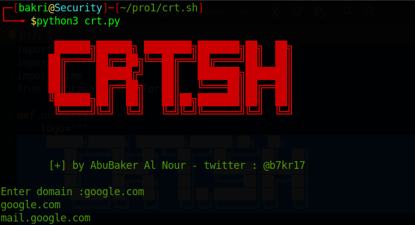

	 	██████╗██████╗ ████████╗███████╗██╗  ██╗
        ██╔════╝██╔══██╗╚══██╔══╝██╔════╝██║  ██║
        ██║     ██████╔╝   ██║   ███████╗███████║
        ██║     ██╔══██╗   ██║   ╚════██║██╔══██║
        ╚██████╗██║  ██║   ██║██╗███████║██║  ██║
         ╚═════╝╚═╝  ╚═╝   ╚═╝╚═╝╚══════╝╚═╝  ╚═╝
       
  	
	 [+] by AbuBaker Al Nour - twitter : @b7kr17

## Describtion
A script that fetches results from a website
https://crt.sh

It is more accurate and tidy

## Installation :
- Install with git: `git clone https://github.com/b7kr17/crt.sh.git`
- Install with ZIP file: [Download here](https://github.com/b7kr17/crt.sh/archive/refs/heads/main.zip)

## Usage :
- After Download `cd crt.sh/`

- Use  :`python3 crt.py`

